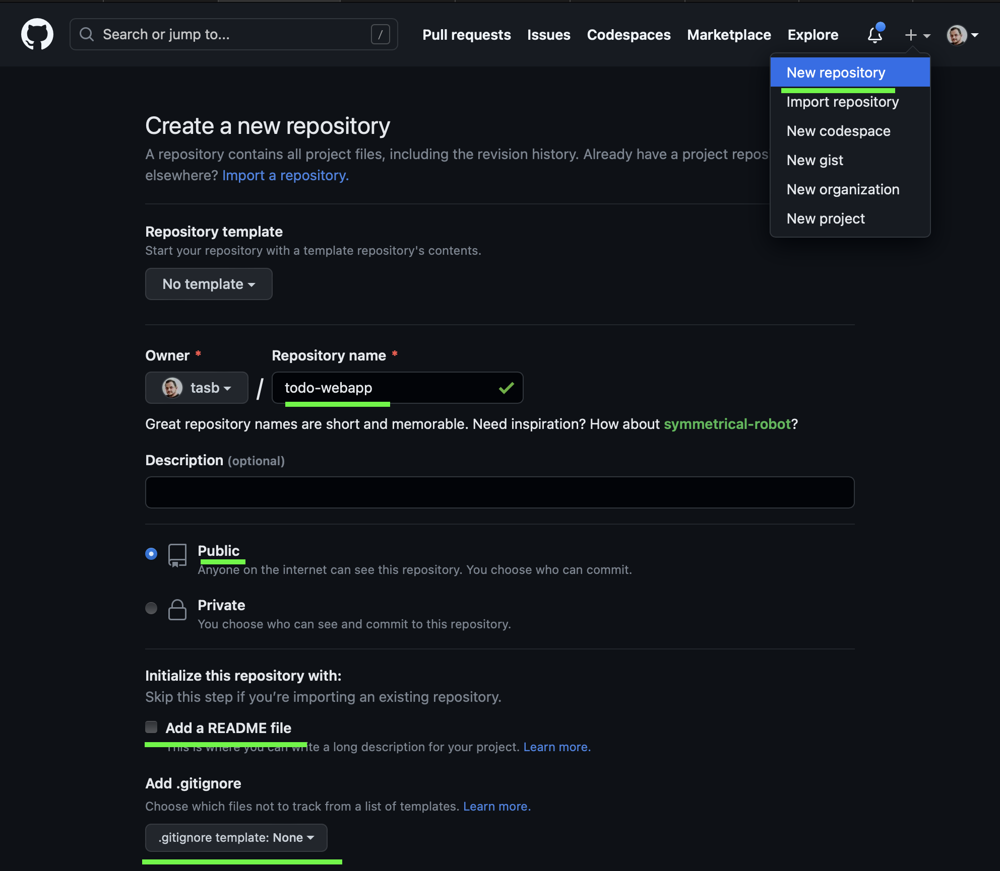
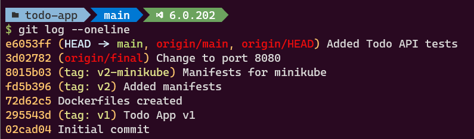
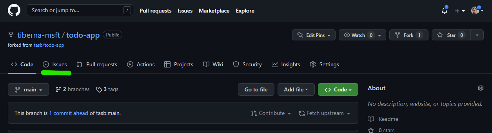
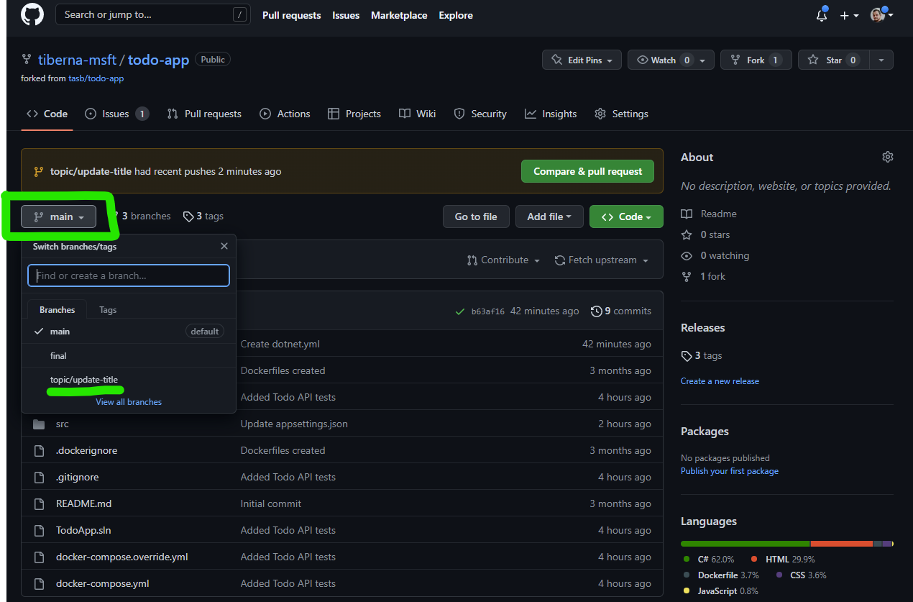
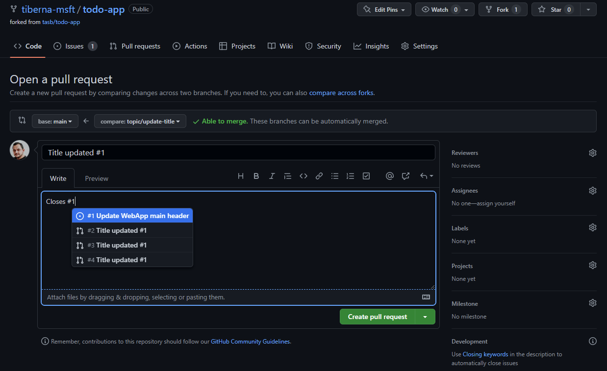
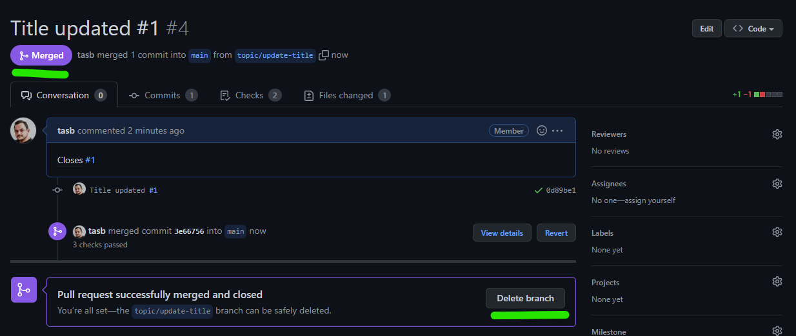

# Lab01: Plan, Build & Test

## Learning Objectives

- Create a new repo on GitHub
- Configure a new repo to use Pull Requests
- Create an Issue
- Create a Pull Request
- Complete a Pull Request
- Clean up your local repo to be ready for new developments 

## Instructions

- [Getting Started](#getting-started)
- [Enforce Pull Request Usage](#enforce-pull-request-usage)
- [Open an issue](#open-an-issue)
- [Add PR Template](#add-pr-template)
- [Create Pull Request](#create-pull-request)
- [Clean Up Local Repo](#clean-up-local-repo)

## Getting Started

Before you can start you need to have a repo with the base code of the app that you will use on this (and all) lab(s).

The ToDo App source code is available at <https://github.com/tasb/todo-app>.

First, create a new repo on your GitHub account. You may use the same name of the original repo, `todo-app`, or you may use any other name.

On following image you may see how to create a new repo on your GitHub account and the configuration you should set. You should **not** check the option `Initialize this repository with a README` since you're going to clone the repo from the original source.



Now open a terminal on your machine and navigate to a folder where you want to work with your repo.

On that folder, run the following commands, replacing <GH_USERNAME> and <GH_REPO_NAME> with your GitHub username and the name of the repo you created on previous step, respectively.

```bash
mkdir init-repo

cd init-repo

git clone --bare https://github.com/tasb/todo-app.git

cd todo-app.git

git push --mirror https://github.com/<GH_USERNAME>/<GH_REPO_NAME>.git
```

Now you're have your repo on your GitHub account. You may navigate to your repo and see that it's empty.

But since you make a mirror push you don't have any history on your repo. To fix that you need to clone your repo to your machine and push the history to your repo.

```bash
cd ../..

rm -rf init-repo

git clone https://github.com/<GH_USERNAME>/<GH_REPO_NAME>.git

cd <GH_REPO_NAME>
```

Now you have your repo on your machine and you may navigate to that folder and see that you have all the history of the original repo.

And now run the following command to check that you have all the history of the repo on your machine.

```bash
git log --oneline
```

You should get an output like the one on the following image.



## Enforce Pull Request Usage

Before starting change your repo, let's add some policies to enforce Pull Requests on `main` branch and enable Issues on your repo.

Click on `Settings` option on tool bar as shown on next image.


On main screen, check the `Issues` option to enable GitHub Issues on your repo.


Next navigate to `Branches` option available on the left side option, under block `Code and Automation`. On that screen click on `Add rule` button as shown on next image.


On new screen, add `main`on `Branch name pattern`. This option will enable this policy on `main` branch, meaning that all merges (updates) on that branch must came from a Pull Request.

You need to enable the option `Require a pull request before merging` to enable the policy. You need to **disable** `Required approvals` option, since you're the only user on that repo and by default, GitHub don't allow that the creator of a pull request can approve his own changes.

At the end, your rule must have the following details.


After making this configuration, you need to click on `Create` green button on the bottom of this page. You may need to enter again your password to confirm this change. After you do that you must see a similar screen like the one below.


Now you're ready to change your code!

## Open an issue

As a good practice you should always have a work item to support any change on your code. On GitHub that is done using GitHub Issues.

The change you will do is to create a pull request template to allow you to created a better and formatted pull request description.

Start to navigate to `Issues` option on top of your repo.



Then click on `New Issue` button and use the following details on your issue:

- Title: `Create pull request template`
- Description: `Create a pull request template to allow you to create a better and formatted pull request description.`
- Assignee: `Yourself`

Then click on `Submit new issue` button and your issue will be created. After that you may see a screen where you may have a conversation about this issue with another members of your team.

To see your newly created issue on the list, you may click on `Issue` option that your clicked previously.

## Add PR Template

To change your code you need to "return" to your machine to properly update your code.

Remember that your `main` branch is closed to direct changes so you need to use an additional branch.

First, let's create and move to the a new branch.

```bash
git checkout -b topic/add-pr-template
```

You may use any name for your branch but using `topic/add-pr-template` you are following some best practices. First, using `topic/` you're grouping this branch on all topic branches that you may create on your repo.

Then, using `add-pr-template` you're using a short name to identity what you're doing. Another option could be using the number o the issue that you're working on like `issue-1`.

Create a new file on root folder of your repo on `PULL_REQUEST_TEMPLATE.md` and add the following content.

```markdown
## Describe your changes

## Issue ticket number and link

## Checklist before requesting a review
- [ ] Do self-review of my code
- [ ] Added unit tests (if applicable)
- [ ] This PR fixes a bug. PR should be merged less than 24 hours after creation.
```

Let's push this change to your remote repo.

```bash
git add -A

git commit -a -m "Added PULL_REQUEST_TEMPLATE.md. Implements #1"
```

Pay attention to commit message and don't forget to add `#1` part. This will automatically link your commit with the issue that you created before.

This link can have additional feature, like closing automatically you're issue. Please check [Closing Issues via Commit Messages](https://github.blog/2013-01-22-closing-issues-via-commit-messages/) for more details.

Now you're ready to add this change to you remote repo.

```bash
git push
```

You got an error right? :) That's because you don't have yet the new branch on remote repo. Git automatically give you the command you need to execute (can be slightly different if you use another branch name)

```bash
git push --set-upstream origin topic/add-pr-template
```

If you return to your GitHub page and click on `Code` option (left from previously select `Issues` option), you may confirm that the new branch were created, after click on dropdown with `main` as selected option.



Additionally you see a banner stating that a new branch was created and you may create a new Pull Request. Let's see how to do it!

## Create Pull Request

To create your pull request, click on the button `Compare & pull request` on the banner on top of your repo.

Because you forked this repo from another one, you can create pull requests to make updates on original repo. This is one of the key feature of Git related with collaboration on distributed team, open source methodologies and innersourcing.

On this particular case, we only want to update `main` branch on our repo, so you need to reflect that on the target branch.

You may check that the title of your pull request is already set with you commit message.

Recall that you added a link from your commit to your issue. Let's do it with your Pull Request too. Now that you are doing a final step toward reaching `main` branch, you may make the link and close the issue.

To close and link the issue with only one step, you may add a comment when you are creating your Pull Request stating that. Add `Closes #1` comment on your Pull Request. You'll see that when you enter `#` character you automatically have access to a list of issues to select from. After you enter the command, the `#1` became a link direct to your issue.



Since you don't have yet the template on your main branch, you may see that the template is not being used. You may see that on the `Files changed` tab.

As soon as you do the merge, you'll see that the template will be used on new pull requests.

Let's proceed clicking on `Create pull request` button to get access to additional details. As soon as your pull request starts, you may see that some checks are done.

For now, is only merge conflict. Pull requests automatically check if a merge conflict may arise if you do the merge. If so, you're not able to finish your pull request.

Now you are ready to complete your Pull Request and do the merge to the `main` branch. As stated before, on this lab we are not able to add reviewers since your doing this steps alone and GitHub don't allow you to approve your own changes.

Click on `Merge Pull Request` green button, you may leave or update the message that will be added to the merge commit you're about to perform and click on `Confirm Merge`

Because you created a topic branch that is a short-lived branch, you may (let say, must... :)) delete your branch to keep your branch list clean.

You have that option directly after merge is completed so click on the button `Delete Branch`.

Finally, you may navigate to your issue and confirm that its state changed to closed and you have a reference to the pull request on the `Development` block on the left side.



## Clean Up Local Repo

You already clean up your remote repo but due to Git being a distributed version control system, your local repo didn't received any change automatically.

First step, is to move again to `main` branch.

```bash
git checkout main
```

Now you need to update your branch with the last merge performed on remote side through Pull Request.

```bash
git pull
```

Last step is to keep your repo clean and ready to develop another improvement your code base. For that you need to delete the branch created to update main page title.

```bash
git branch -d topic/add-pr-template
```

And it's done! You may repeat this process as needed to bring more value to your end user!

## Congratulations

You've successfully completed this lab! Now you may feel more prepared to implement Pull Request and basic automation on your projects!
