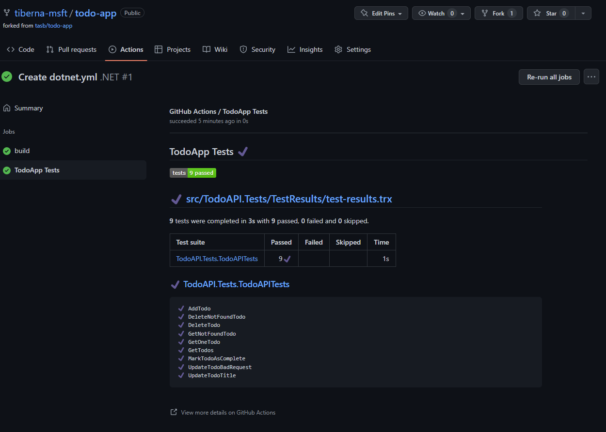
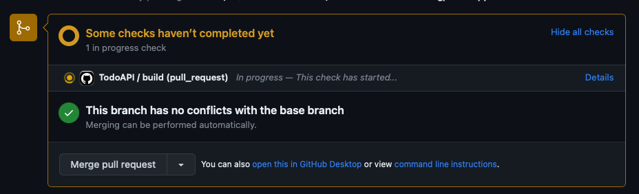
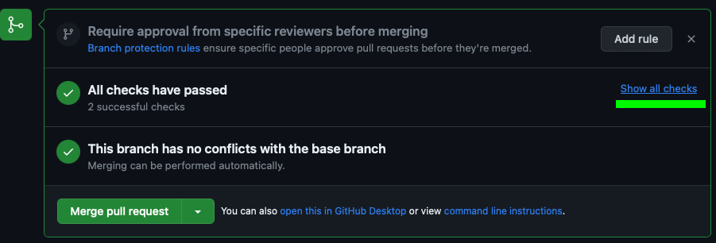
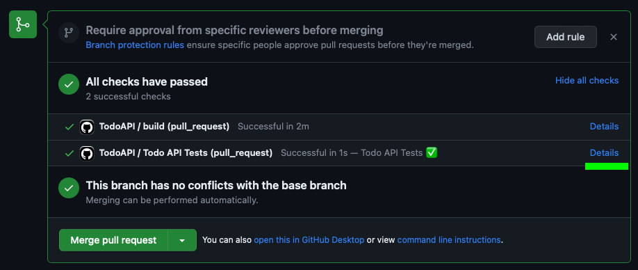
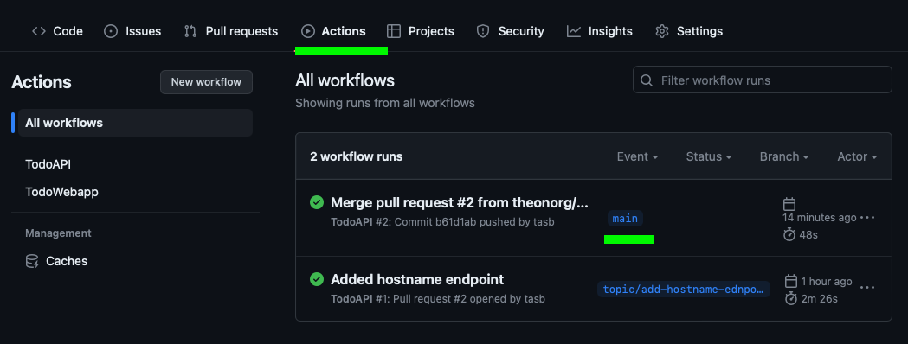
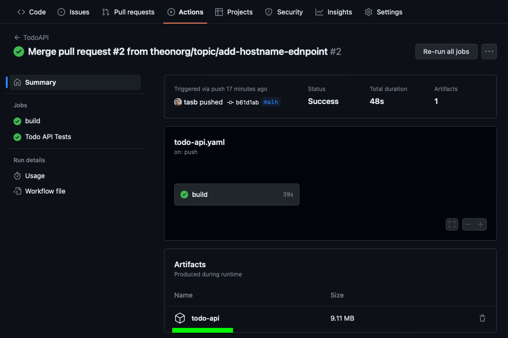

<!-- no toc -->
# Lab 02 - Build & Test

On this lab you'll create your first automation for build & test your code

## Learning Objectives

- Create a workflow to build and test your code
- Use Pull Request to validate your code
- Run Continuous Integration workflow
- Manage your local repo

## Instructions

- [Getting Started](#getting-started)
- [Create Workflows](#create-workflows)
- [Create Pull Request](#create-pull-request)
- [Validate Pull Request](#validate-pull-request)
- [Continuous Integration](#continuous-integration)
- [Clean Up Local Repo](#clean-up-local-repo)

## Getting Started

To start you need to create a new branch on your repo. This branch will be used to create your first automation.

On your local repo, execute the following commands to create a new branch named `build-test`.

```bash
git checkout main

git pull

git checkout -b build-test
```

## Create Workflows

You need to create two workflows, one for TodoAPI and another for TodoWebApp.

### TodoAPI

Create a file named `todo` on `.github/workflows` folder and add the following content.

```yaml
name: TodoAPI

on:
  push:
    branches: [ main ]
    paths:
      - 'src/TodoAPI/**'
      - 'src/TodoAPI.Tests/**'
      - '.github/workflows/todo-api.yml'
  pull_request:
    branches: [ main ]
    paths:
      - 'src/TodoAPI/**'
      - 'src/TodoAPI.Tests/**'
      - '.github/workflows/todo-api.yml'

jobs:
  build:

    runs-on: ubuntu-latest

    steps:
    - uses: actions/checkout@v3
    - name: Setup .NET
      uses: actions/setup-dotnet@v2
      with:
        dotnet-version: 6.0.x
    - name: Restore dependencies
      run: |
        dotnet restore src/TodoAPI/TodoAPI.csproj
        dotnet restore src/TodoAPI.Tests/TodoAPI.Tests.csproj
    
    - name: Build
      run: |
        dotnet build --no-restore src/TodoAPI/TodoAPI.csproj
        dotnet build --no-restore src/TodoAPI.Tests/TodoAPI.Tests.csproj
    
    - name: Test
      run: dotnet test --no-build src/TodoAPI.Tests/TodoAPI.Tests.csproj --verbosity normal --logger "trx;LogFileName=test-results.trx"
      
    - name: Test Report
      uses: dorny/test-reporter@v1
      if: always()
      with:
        name: Todo API Tests
        path: '**/TestResults/*.trx'
        reporter: dotnet-trx
    
    - name: Publish
      if: github.event_name != 'pull_request'
      run: |
        dotnet publish --no-build src/TodoAPI/TodoAPI.csproj -o src/TodoAPI/publish

    - uses: actions/upload-artifact@v3
      if: github.event_name != 'pull_request'
      with:
        name: todo-api
        path: src/TodoAPI/publish
```

Take a look to your workflow and check the triggers and all actions that will be performed.

On triggers, you may check that this workflow will run when a push is made on `main` branch or a pull request with `main` branch as final target is created or updated. Also, you may check that this workflow will run only when changes are made on `src/TodoAPI` folder, `src/TodoAPI.Tests` folder or `.github/workflows/todo-api.yml` file.

On this workflow you'll run unit testing and publish the results directly on GitHub Actions interface. To do that, you'll use the `dorny/test-reporter` action.

To run your unit tests and generate output on a specific format, you need to the following action.

```yaml
- name: Test
  run: dotnet test --no-build src/TodoAPI.Tests/TodoAPI.Tests.csproj --verbosity normal --logger "trx;LogFileName=test-results.trx"
```

The next action is where you publish unit testing report to GitHub Actions interface.

```yaml
- name: Test Report
  uses: dorny/test-reporter@v1
  if: always()
  with:
    name: TodoApp Tests
    path: '**/TestResults/*.trx'
    reporter: dotnet-trx
```

When you run your pipeline, you may have a look to the `Test Report` step and check the results. You'll get a report like the following.



### TodoWebApp

Create a file named `todo-webapp.yaml` on `.github/workflows` folder and add the following content.

```yaml
name: TodoWebapp

on:
  push:
    branches: [ main ]
    paths:
      - 'src/TodoWebapp/**'
      - '.github/workflows/todo-webapp.yml'
  pull_request:
    branches: [ main ]
    paths:
      - 'src/TodoWebapp/**'
      - '.github/workflows/todo-webapp.yml'

jobs:
  build:

    runs-on: ubuntu-latest

    steps:
    - uses: actions/checkout@v3
    - name: Setup .NET
      uses: actions/setup-dotnet@v2
      with:
        dotnet-version: 6.0.x
    - name: Restore dependencies
      run: |
        dotnet restore src/TodoWebapp/TodoWebapp.csproj
    
    - name: Build
      run: |
        dotnet build --no-restore src/TodoWebapp/TodoWebapp.csproj
    
    - name: Publish
      if: github.event_name != 'pull_request'
      run: |
        dotnet publish --no-build src/TodoWebapp/TodoWebapp.csproj -o src/TodoWebapp/publish

    - uses: actions/upload-artifact@v3
      if: github.event_name != 'pull_request'
      with:
        name: todo-webapp
        path: src/TodoWebapp/publish
```

Take a look into this workflow and check the triggers and all actions that will be performed. You may check that this workflow will run when a push is made on `main` branch or a pull request with `main` branch as final target is created or updated. Also, you may check that this workflow will run only when changes are made on `src/TodoWebapp` folder or `.github/workflows/todo-webapp.yml` file.

You don't have a unit testing action since this project doesn't have any unit test.

## Create Pull Request

Now, you can send your changes to remote repo. You need to execute the following commands.

```bash
git add -A

git commit -m "Add GitHub Actions workflows"

git push -u origin build-test
```

Navigate to your GitHub repo to check that your changes are there and to start Pull Request.

To create your pull request, click on the button `Compare & pull request` on the banner on top of your repo.

You may check that the title of your pull request is already set with you commit message. You can add a description if you want.

Let's proceed clicking on `Create pull request` button to get access to additional details.

As soon as your pull request starts, you may see that merge conflict is evaluated to give a clear understanding if you can proceed with the merge.

Since your workflow will not run on this pull request (because you're changing the workflow itself), you may proceed with the merge.

On these labs we are not able to add reviewers since you're doing these steps alone and GitHub don't allow you to approve your own changes.

Click on `Merge Pull Request` green button, you may leave or update the message that will be added to the merge commit you're about to perform and click on `Confirm Merge`

Because you created a topic branch that is a short-lived branch, you may (let say, must... :)) delete your branch to keep your branch list clean.

You have that option directly after merge is completed so click on the button `Delete Branch`.

## Validate Pull Request

Let's make a simple change on your code base to trigger your workflow.

On this change, you'll add a new endpoint on the API to return the hostname of the machine where the API is running.

First you need to clean up your local repo.

```bash
git checkout main

git pull

gir branch -d build-test
```

Then, let's create a new branch to make the new developments.

```bash
git checkout -b topic/add-hostname-endpoint
```

Now, let's make a change on your code.

Open your code on a code editor of your choice an navigate to the following file `src/TodoAPI/Program.cs` and navigate to the end of the file, where you'll find this line of code.

```csharp
app.Run();
```

Add the following code before that line.

```csharp
app.MapGet("/hostname", () =>
{
    var hostname = System.Net.Dns.GetHostName();
    app.Logger.LogInformation("Getting hostname: {Hostname}", hostname);
    return Results.Ok(hostname);
})
.WithName("Hostname");
```

Now you've your code update (don't forget to save the file :)).

Let's commit your changes and push to remote repo.

```bash
git commit -a -m "Add hostname endpoint"

git push -u origin topic/add-hostname-endpoint
```

Navigate to your GitHub repo to check that your changes are there and to start Pull Request (following the process describe on previous section).

When you create your pull request, you may check that your workflow is running to build your code and run the unit tests. You get a checks list like this.



After your workflow runs successfully, you got a green checkmark of your Pull Request details that allow you to get more details about it.

First, click on `Show all checks` link to get access to all checks performed on your pull request.



Then, click on `Details` link to get access to the workflow execution details, mainly on unit tests reporting.



With these checks you may feel more confident to merge your changes to `main` branch. So, let's proceed with the merge.

lick on `Merge Pull Request` green button, you may leave or update the message that will be added to the merge commit you're about to perform and click on `Confirm Merge`

Because you created a topic branch that is a short-lived branch, you may (let say, must... :)) delete your branch to keep your branch list clean.

You have that option directly after merge is completed so click on the button `Delete Branch`.

## Continuous Integration

As soon as you finish your Pull Request and your changes are merged to `main` branch, your workflow will run again to build and test your code. But since we are running caused by a change on `main` branch a package you'll created and published on GitHub Actions artifacts.

This package will be used in next labs to deploy your application to Azure App Service.

Navigate to the Actions menu and check you have a list of workflows executed. On the top of the list, you have an execution mentioning `main` branch. That one was executed because of the merge you've performed.



If you click on the workflow execution, you may check that the workflow was executed successfully and get more details like logs.

At the end of the screen, you get a list of artifacts generated by your workflow. You may download the artifact to get access to the package generated.



## Clean Up Local Repo

You already clean up your remote repo but due to Git being a distributed version control system, your local repo didn't received any change automatically.

First step, is to move again to `main` branch.

```bash
git checkout main
```

Now you need to update your branch with the last merge performed on remote side through Pull Request.

```bash
git pull
```

Last step is to keep your repo clean and ready to develop another improvement your code base. For that you need to delete the branch created to update main page title.

```bash
git branch -d topic/update-title
```

And it's done! You may repeat this process as needed to bring more value to your end user!

## Congratulations

You've successfully completed this lab! Now you may feel more prepared to implement Pull Request and basic automation on your projects!
