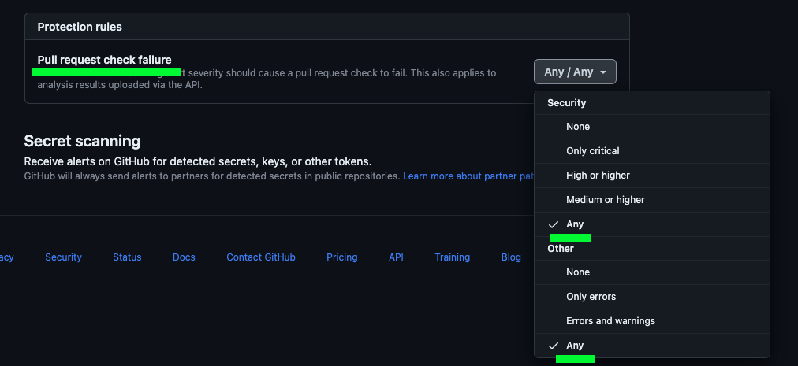
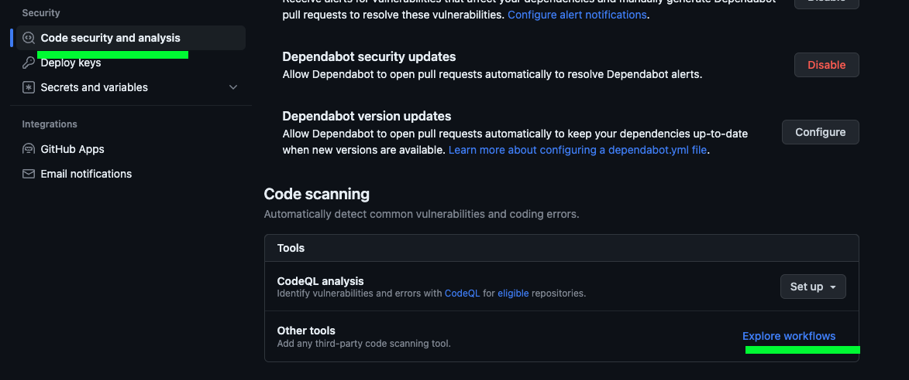
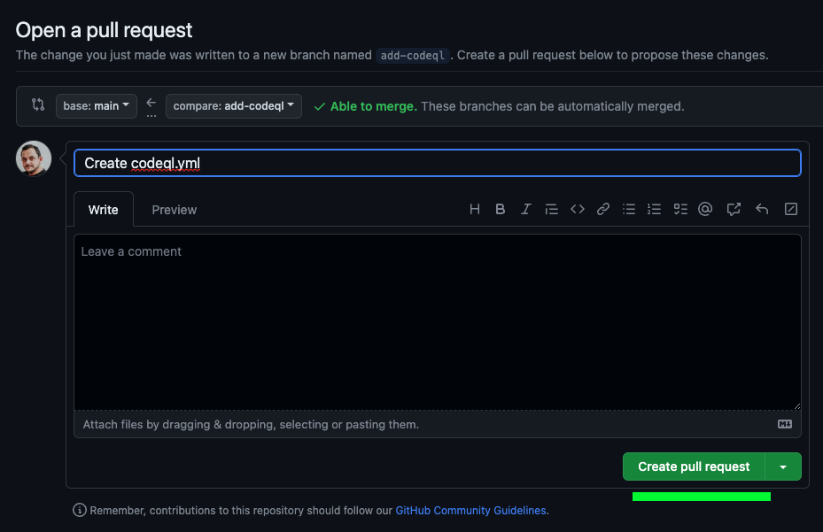
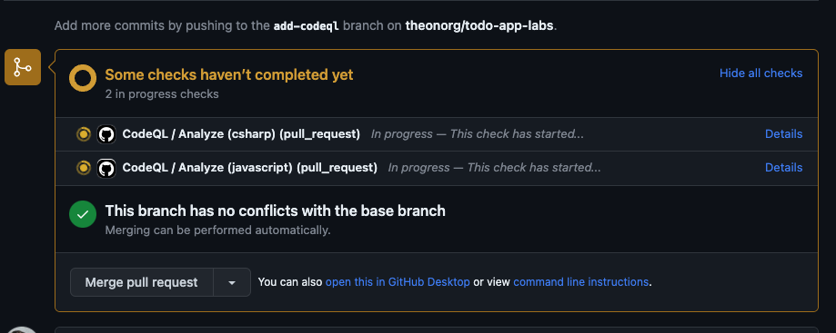

# Lab 03 - Secure DevOps

On this lab you'll add security checks to your CI pipeline to ensure that your code is secure and you're not introducing any vulnerabilities on your code.

## Learning Objectives

In this lab, you will learn how to:

- Enable security tools
- Get Dependabot version updates
- Run Dependency Graph on your code to get a better understanding of your dependencies
- Having a proper SAST scan on your code

## Instructions

- [Enable security tools](#enable-security-tools)
- [Dependabot version updates](#dependabot-version-updates)
- [Create SAST pipeline](#create-sast-pipeline)

## Enable security tools

Since you have your CI pipeline ready, is important to have security checks to keep your application code as secure as possible.

Let's enable automatic check provided by GitHub about your dependencies graph and secret scanning.

Navigate to `Settings` > `Code security and analysis` and enable the following checks.

- Dependency graph
- Dependabot alerts
- Dependabot security updates
- Secret scanning

Be aware that `Code scanning` should be disable since you will only enable it on next step.

Now you need to change `Pull request check failure` to a more restrictive setting on your security checks.



As soon as you enable it, GitHub automatically starts scanning your dependencies to find any known vulnerabilities.

To get the scanning report navigate to `Insights` > `Dependency graph` and take a look on the amount of dependencies your code have, since this feature scans recursively all your dependencies.

You may check the tag `Dependencies` and the tab `Dependents` to see how many projects are using your project as a dependency.

## Dependabot version updates

This Dependabot feature will automatically create pull requests to update your dependencies to the latest version available.

To enable this feature navigate to `Settings` > `Security & analysis` > `Dependabot` and enable `Dependabot version updates`.

When you enable this feature, a new screen will appear asking you to select the package manager you're using on your project. On this case, we're using `NuGet`.

On the yaml file that you see, you need to find the following line:

```yaml
- package-ecosystem: "" # See documentation for possible values
```

And change it to:

```yaml
- package-ecosystem: "nuget" # See documentation for possible values
```

If you check the yaml code, you can see that this workflow will run on a weekly basis.

To save this file you need to commit the changes to a new branch using GitHub web interface. To do that click on `Commit changes...` button on top right and select `Create a new branch for this commit and start a pull request` option, setting `add-dependabot` as branch name.

To finish the commit, click on `Commit changes` button.

Go and finish your pull request and you'll start to receive pull requests to update your dependencies. Don't forget to delete now needed branch.

This process is really good for your development team since you get a clear understand if you have any impact on build phase if you change your libraries version.

This procedure is only for you check how it works, but you should not merge this pull requests since you're not using the latest version of your dependencies.

Please take a look into your email too. You get notified about this pull requests and you can see the impact of this feature on your development team.

## Create SAST pipeline

To start having Secure DevOps approach on your CI/CD pipeline, you need to perform a SAST scan on your code on any change you produce. We will use GitHub Code QL integration to easily set up this scan for you.

To set up the scanning navigate to `Settings` > `Security & analysis` > `Code Scanning` menu and click on `Explore workflows` link.



On new screen you may take a look and confirm the amount of different solutions available, knowing this number is growing every day.

On this lab, we'll use CodeQL Analysis, that must be the first option on the list. When you find that option, select `Configure`.

After clicking on `Configure` button, you'll be redirected to a new screen with a GitHub Action workflow already created for you.

GitHub will automatically verify your repo and check which languages are available on your source code and set up the workflow to scan that languages.

You may confirm that by check line 35 as you'll see this: `language: [ 'csharp', 'javascript' ]`

Check the triggers configured on this workflow.

```yaml
on:
  push:
    branches: [ "main" ]
  pull_request:
    # The branches below must be a subset of the branches above
    branches: [ "main" ]
  schedule:
    - cron: '31 4 * * 2'
```

This workflow will run on every push to `main` branch, on every pull request to `main` branch and every Tuesday at 4:31 AM (on your case this can be on a different schedule).

The schedule trigger allow you to use a crontab expression to define when you want to run your workflow using a time-based trigger. To get more details (and create different crontab expression), you may navigate to [crontab.guru](https://crontab.guru/#31_4_*_*_2).

Other important part of this pipeline is how the build is done. An `autobuild` is used to build your code and run the scan on the build output.

```yaml
- name: Autobuild
  uses: github/codeql-action/autobuild@v2
```

Before proceeding, you need to add additional configuration on Code QL Analysis. To do that, you need to add the following line on line #50 to your workflow file.

```yaml
queries: security-extended,security-and-quality
```

So your `Initialize CodeQL` step will look like this:

```yaml
- name: Initialize CodeQL
  uses: github/codeql-action/init@v2
  with:
    languages: $\{\{ matrix.language \}\}
    queries: security-extended,security-and-quality
```

Since you're using a standard project/solution structure, you don't need to change anything on this workflow. But if you get a different structure or a specific build process, you may need to change this part of the workflow, commenting the `autobuild` and adding your own build process.

To save this file you need to commit the changes to a new branch using GitHub web interface. To do that click on `Commit changes` button on top right and select `Create a new branch for this commit and start a pull request` option, setting `add-codeql` as branch name.

To finish the commit, click on `Commit changes` button.

You get automatically a new screen to create a new Pull Request from the branch you just created.



After creating your PR, you may confirm that the checks will run automatically and starting to scan your code to find vulnerabilities.



Complete your pull request to add this new workflows on your `main` branch. Don't forget to delete now needed branch.

As soon as you workflow is added to `main` branch, the Code QL workflow will run again. After finishing, Code QL scanning will populate code scanning alerts on your repo and you have a list of them navigating to `Security` > `Code scanning alerts`.

On this case, you may have 16 issues identified, must of them Javascript code. This code is from libraries that are used on your project so you can turn off the analysis on those folders but for these labs we'll continue to have them scanned.

You may click on each of them to have better understanding about this alerts and on this case check that all of the alerts are on JQuery code.

Congratulations! Now you have your codebase scanned and you can start to fix the issues identified!
