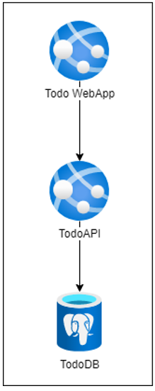

# Lab 04 - Continuous Deployment

On this lab you'll add a new stage to your CI pipeline to deploy your application to Azure App Service. You will create your infrastructure manually and add two environments: `Development` and `Production`.

## Learning Objectives

In this lab, you will learn how to:

- Create a new stage on your CI pipeline to deploy your application to Azure
- Create infrastructure manually on Azure

## Instructions

- [Configure Service Principal](#configure-service-principal)
- [Create Azure Infrastructure](#create-azure-infrastructure)
- [Add CD stage](#add-cd-stage)
- [Configure Azure App Service](#configure-azure-app-service)

## Configure Service Principal

On this lab, we'll use better option to integrate GitHub Workflows with Azure, that is using a workload identity integrated with GitHub.

First, you need to install Az CLI on your machine. You can find the instructions [here](https://docs.microsoft.com/en-us/cli/azure/install-azure-cli).

Then, you need to login Az CLI on Azure. For that, run this command:

```bash
az login --use-device-code
```

This command will output something like this:

```bash
To sign in, use a web browser to open the page https://microsoft.com/devicelogin and enter the code XXXXXX to authenticate.
```

Follow the instructions and login with your Azure account, using the username and password provided to you by IT support team.

Now, you can create an App Registration that is an object on Azure Active Directory that represents your application.

You need to be careful naming your resources, since everyone is sharing some subscription, so let's use first letter of your first name and your last name to identify your resources, using it as prefix.

On my case, my prefix is `tbernardo`.

For that, run this command:

```bash
az ad app create --display-name <PREFIX>-github-workflow
```

You should get an JSON outcome. Please copy the `appId` (referenced as `<APP_ID>` in following commands) and `Id` (referenced as `<OBJECT_ID>` in following commands) value, since you'll need it later.

Now create a JSON file named `policy.json` and add the following content on it:

```json
{
  "name": "MyFederatedCredential",
  "issuer": "https://token.actions.githubusercontent.com",
  "subject": "repo:<GH-USERNAME>/<GH-REPO>",
  "audiences": [
    "api://AzureADTokenExchange"
  ]
}
```

On the file you should replace the following tokens:

- GH-USERNAME, with your GitHub username
- GH-REPO, with your GitHub repository name

This file will be used to create a Federated Credential between your Azure AD (through your App Registration) and your GitHub repository and allow only the workflows on your repository to use the credentials created on this App Registration.

Now, execute the following command to create a credential on your App Registration:

```bash
az ad app federated-credential create --id <OBJECT_ID> --parameters @policy.json
```

Finally, you need to create a Service Principal, the service account that will effectively do the login in Azure on behalf of your GitHub workflow.

For that, run the following command:

```bash
az ad sp create --id <APP_ID>
```

Next step is to add a proper role to this Service Principal, so it can create resources on Azure.

On this lab, we'll use the `Contributor` role, that allows the Service Principal to create, update and delete resources on all Subscription. On the real world, you should use a more restrictive role, but since we are creating everything from the scratch, we'll use this role.

For that, run the following command:

```bash
az role assignment create --assignee <APP_ID> --role Contributor --scope "/subscriptions/49175c01-02a7-44bb-b379-2c06f4aae5b4"
```

Last step, is to make this details available on GitHub repository, so the workflows can use it.

To do that you'll use 3 secrets, to store the values in a secure way.

Go to your repo and navigate to `Settings > Secrets and variables > Actions`, then click on `New repository secret` and add the following secrets (you need to repeat this step 3 times):

- Secret #1
  - Name: AZURE_CLIENT_ID
  - Secret: <APP_ID>
- Secret #2
  - Name: AZURE_TENANT_ID
  - Secret: d5fe066f-22b6-4c2b-acc3-04f8b6dddf6c
- Secret #3
  - Name: AZURE_SUBSCRIPTION_ID
  - Secret: 49175c01-02a7-44bb-b379-2c06f4aae5b4

Now your ready to integrate your workflows with Azure, but first you need to create the infrastructure.

## Create Azure Infrastructure

This Todo App have the following architecture depicted on the image below.



To deploy this in Azure you need a PostgreSQL Server and 2 App Services (Web Server as a Service).

### Resource Group

Every resource on Azure must be inside a Resource Group. This is a logical container that allows you to manage all resources inside it.

To create a Resource Group, run the following command:

```bash
az group create --name <PREFIX>-todoapp --location westeurope
```

### PostgreSQL Server

Navigate to [Azure Database for PostgreSQL flexible servers](https://portal.azure.com/#view/HubsExtension/BrowseResource/resourceType/Microsoft.DBforPostgreSQL%2FflexibleServers) and do the login if needed.

This Azure Resource is how you create a PaaS PostgreSQL Server on Azure.

To make manual configuration, you need to follow a wizard through several screens. To start this wizard, click on `+ Create` button.

You should set exactly the following values and leave default values on properties not mentioned.

Starting with `Basics` screen:

- Subscription: `MoOngy Training`
- Resource group: `<PREFIX>-todoapp`
- Server name: `<PREFIX>-todoapp-prd-psql`
- Region: `West Europe`
- PostgreSQL version: `14`
- Workload type: `Development`
- Admin username: `dbadmin`
- Password: `P@ssw0rd`

Then, on `Networking` screen:

- Check on `Allow public access from any Azure service within Azure to this server`
- Click on `+ Add current client IP address`

Now, you can click oni `Review + create` and then `Create`.

This resource takes some time to be created, so you can continue with the next steps.

### App Services

An App Service is a PaaS Web Server on Azure that allow you to use Linux or Windows base system and several languages and frameworks.

You need to create an App Service Plan first, that represents the underlying infrastructure that will host your App Services. Then you can create one or more App Services that will be hosted on this App Service Plan and share its resources.

Navigate to [App Services](https://portal.azure.com/#view/HubsExtension/BrowseResource/resourceType/Microsoft.Web%2Fsites).

Then click on `+ Create` button to start the wizard to create an App Service. Like PostgreSQL, change all the values described below, leaving default values on properties not mentioned.

On `Basics` screen, set the following values:

- Subscription: `MoOngy Training`
- Resource group: `<PREFIX>-todoapp`
- Name: `<PREFIX>-todoapp-prd-web`
- Publish: `Code`
- Runtime stack: `.NET 6 (LTS)`
- Operating System: `Linux`
- Region: `West Europe`
- Click on `Create New` link under the dropdown box at Linux Plan (West Europe) property. Add the following name on the new box: `<PREFIX>-todoapp-prd-web-plan`
- Pricing plan: `Basic B1`

On `Monitoring` screen, set the following values:

- Enable Application Insights: `No`

Then, on `Review + create` screen, click on `Create`.

This will create the App Service Plan that will be used by both App Services and the App Service where you'll deploy the WebApp.

Now, let's create the App Service where you'll deploy the API.

Click on `+ Create` button to start the wizard to create an App Service. Like PostgreSQL, change all the values described below, leaving default values on properties not mentioned.

On `Basics` screen, set the following values:

- Subscription: `MoOngy Training`
- Resource group: `<PREFIX>-todoapp`
- Name: `<PREFIX>-todoapp-prd-api`
- Publish: `Code`
- Runtime stack: `.NET 6 (LTS)`
- Operating System: `Linux`
- Region: `West Europe`
- Linux Plan (West Europe): `<PREFIX>-todoapp-prd-web-plan`

On `Monitoring` screen, set the following values:

- Enable Application Insights: `No`

Then, on `Review + create` screen, click on `Create`.

Now you have all the infrastructure needed to deploy the application. Let's update the workflows to deploy the application.

## Add CD stage

Now, you'll add a new stage to each workflow to deploy the application to Azure.

First, you need to create a new branch, executing the following command:

```bash
git checkout main

git pull

git checkout -b feature/cd
```

Then, you need to update the workflows to add a new stage to deploy the application to Azure.

First, edit `.github/workflows/todo-api.yaml` file and replace its content with the following:

```yaml
name: TodoAPI

on:
  push:
    branches: [ main ]
    paths:
      - 'src/TodoAPI/**'
      - 'src/TodoAPI.Tests/**'
      - '.github/workflows/todo-api.yaml'
  pull_request:
    branches: [ main ]
    paths:
      - 'src/TodoAPI/**'
      - 'src/TodoAPI.Tests/**'
      - '.github/workflows/todo-api.yaml'

env:
  AZURE_WEBAPP_NAME: "<PREFIX>-todoapp-prd-api"
  ARTIFACT_NAME: "todo-api"

permissions:
  id-token: write
  contents: read

jobs:
  build:

    runs-on: ubuntu-latest

    steps:
    - uses: actions/checkout@v3
    - name: Setup .NET
      uses: actions/setup-dotnet@v2
      with:
        dotnet-version: 6.0.x
    - name: Restore dependencies
      run: |
        dotnet restore src/TodoAPI/TodoAPI.csproj
        dotnet restore src/TodoAPI.Tests/TodoAPI.Tests.csproj
    
    - name: Build
      run: |
        dotnet build --no-restore src/TodoAPI/TodoAPI.csproj
        dotnet build --no-restore src/TodoAPI.Tests/TodoAPI.Tests.csproj
    
    - name: Test
      run: dotnet test --no-build src/TodoAPI.Tests/TodoAPI.Tests.csproj --verbosity normal --logger "trx;LogFileName=test-results.trx"
      
    - name: Test Report
      uses: dorny/test-reporter@v1
      if: always()
      with:
        name: Todo API Tests
        path: '**/TestResults/*.trx'
        reporter: dotnet-trx
    
    - name: Publish
      if: github.event_name != 'pull_request'
      run: |
        dotnet publish --no-build src/TodoAPI/TodoAPI.csproj -o src/TodoAPI/publish

    - uses: actions/upload-artifact@v3
      if: github.event_name != 'pull_request'
      with:
        name: todo-api
        path: src/TodoAPI/publish
        
  prod:
    if: github.event_name != 'pull_request'
    
    runs-on: ubuntu-latest
    needs: build

    steps:
    - uses: actions/download-artifact@v3
      with:
        name: ${{ env.ARTIFACT_NAME }}
        path: ./${{ env.ARTIFACT_NAME }}
    
    - uses: azure/login@v1
      with:
        client-id: ${{ secrets.AZURE_CLIENT_ID }}
        tenant-id: ${{ secrets.AZURE_TENANT_ID }}
        subscription-id: ${{ secrets.AZURE_SUBSCRIPTION_ID }}
  

    - name: 'Azure webapp deploy - PROD'
      id: prod-deploy
      uses: azure/webapps-deploy@v2
      with: 
        app-name: ${{ env.AZURE_WEBAPP_NAME }} # Replace with your app name
        package: ./${{ env.ARTIFACT_NAME }}
        slot-name: 'production'

    - name: logout
      run: |
        az logout

```

Let's check some of the changes made to this workflow. First, some variables are used to make it easy to change the workflow to deploy to other environments.

The `AZURE_WEBAPP_NAME` variable is used to set the name of the App Service where the application will be deployed.

The `ARTIFACT_NAME` variable is used to set the name of the artifact that will be created and uploaded to the workflow. This artifact will be downloaded by the `prod` job and deployed to Azure.

```yaml
env:
  AZURE_WEBAPP_NAME: "<PREFIX>-todoapp-prd-api"
  ARTIFACT_NAME: "todo-api"
```

Then, you need to set specific permissions on your workflow to be able to use Workload Identity to authenticate with Azure. This is done by adding the following lines to the workflow:

```yaml
permissions:
  id-token: write
  contents: read
```

Finally, you have a new stage on your pipeline, to make the deploy to your Azure infrastrucure.

```yaml
  prod:
    if: github.event_name != 'pull_request'
    
    runs-on: ubuntu-latest
    needs: build

    steps:
    - uses: actions/download-artifact@v3
      with:
        name: ${{ env.ARTIFACT_NAME }}
        path: ./${{ env.ARTIFACT_NAME }}
    
    - uses: azure/login@v1
      with:
        client-id: ${{ secrets.AZURE_CLIENT_ID }}
        tenant-id: ${{ secrets.AZURE_TENANT_ID }}
        subscription-id: ${{ secrets.AZURE_SUBSCRIPTION_ID }}
  

    - name: 'Azure webapp deploy - PROD'
      id: prod-deploy
      uses: azure/webapps-deploy@v2
      with: 
        app-name: ${{ env.AZURE_WEBAPP_NAME }} # Replace with your app name
        package: ./${{ env.ARTIFACT_NAME }}
        slot-name: 'production'

    - name: logout
      run: |
        az logout
```

This stage will download the artifact created by the `build` stage and deploy it to the App Service created previously.

Before doing the deploy, login is performed using the properties you set on secrets.

Now, edit `.github/workflows/todo-webapp.yaml` file and replace its content with the following:

```yaml
name: TodoWebapp

on:
  push:
    branches: [ main ]
    paths:
      - 'src/TodoWebapp/**'
      - '.github/workflows/todo-webapp.yaml'
  pull_request:
    branches: [ main ]
    paths:
      - 'src/TodoWebapp/**'
      - '.github/workflows/todo-webapp.yaml'

env:
  AZURE_WEBAPP_NAME: "<PREFIX>-todoapp-prd-web"
  ARTIFACT_NAME: "todo-app"

permissions:
  id-token: write
  contents: read

jobs:
  build:

    runs-on: ubuntu-latest

    steps:
    - uses: actions/checkout@v3
    - name: Setup .NET
      uses: actions/setup-dotnet@v2
      with:
        dotnet-version: 6.0.x
    - name: Restore dependencies
      run: |
        dotnet restore src/TodoWebapp/TodoWebapp.csproj
    
    - name: Build
      run: |
        dotnet build --no-restore src/TodoWebapp/TodoWebapp.csproj
    
    - name: Publish
      if: github.event_name != 'pull_request'
      run: |
        dotnet publish --no-build src/TodoWebapp/TodoWebapp.csproj -o src/TodoWebapp/publish

    - uses: actions/upload-artifact@v3
      if: github.event_name != 'pull_request'
      with:
        name: todo-webapp
        path: src/TodoWebapp/publish

  prod:
    if: github.event_name != 'pull_request'
    
    runs-on: ubuntu-latest
    needs: build

    steps:
    - uses: actions/download-artifact@v3
      with:
        name: ${{ env.ARTIFACT_NAME }}
        path: ./${{ env.ARTIFACT_NAME }}
    
    - uses: azure/login@v1
      with:
        client-id: ${{ secrets.AZURE_CLIENT_ID }}
        tenant-id: ${{ secrets.AZURE_TENANT_ID }}
        subscription-id: ${{ secrets.AZURE_SUBSCRIPTION_ID }}
  

    - name: 'Azure webapp deploy - PROD'
      id: prod-deploy
      uses: azure/webapps-deploy@v2
      with: 
        app-name: ${{ env.AZURE_WEBAPP_NAME }} # Replace with your app name
        package: ./${{ env.ARTIFACT_NAME }}
        slot-name: 'production'

    - name: logout
      run: |
        az logout
```

You're ready to start the process you already now: commit, push and create a pull request.

After the pull request is created and all your checks are green, merge it to `main` branch.

When you make the merge to main branch, you can check your workflow running on Actions tab.

Only after this merge is when the deploy to Azure will be performed since you add a condition on the `prod` stage to only run when the event is not a pull request.

```yaml
prod:
  if: github.event_name != 'pull_request'
```

## Configure Azure App Service

After the deploy is finished, you can check your App Service on Azure Portal and see the new version of your application running.

But if you try to access it, you'll see an error message since you need to configure some settings on your App Services.

On API service you need to set the connections string to database and on WebApp service you need to set the API URL.

### Configure API App Service

On this App Service, you need to set the connection string to your database. So let's get the proper connection string.

Navigate to App Service that contains Todo API and select option `Configuration` on left menu.

Click on `+ New application setting` button and add a new setting with the following values:

- Name: `ConnectionStrings__TodosDb`
- Value: `Server=<DATABASE_ADDRESS>;Database=TodoDB;Port=5432;User Id=dbadmin;Password=P@ssw0rd;Ssl Mode=VerifyFull;`

The `<DATABASE_ADDRESS>` value is the address of your database. You can get it on Azure Portal, on your PostgreSQL database, on `Connection strings` option.

Click on `OK` button and don't forget to click on `Save` button on top of the page.

Before leave this App Service, you need to do two additional tasks:

- Navigate to `Overview` option on left menu and copy the URL of your API. This available on property `Default Domain`.
- Click on `Restart` button on top of the page.

### Configure WebApp App Service

On this case, you need to set the URL of your API. So, navigate to App Service that contains Todo WebApp and select option `Configuration` on left menu.

Click on `+ New application setting` button and add a new setting with the following values:

- Name: `Services__TodoAPI`
- Value: `http://<API_URL>/todos` where `<API_URL>` is the value you copied previously.

Click on `Restart` button on top of the page to restart your App Service.

Now you should be able to use this Todo App navigating to the URL of your WebApp App Service, that you can find on `Overview` option on left menu and clicking on the URL available on property `Default Domain`.

Congratulations! You have your app running and deployed using a CI/CD pipeline.
