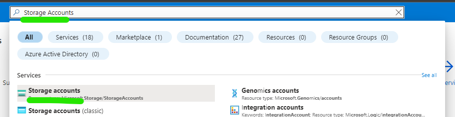
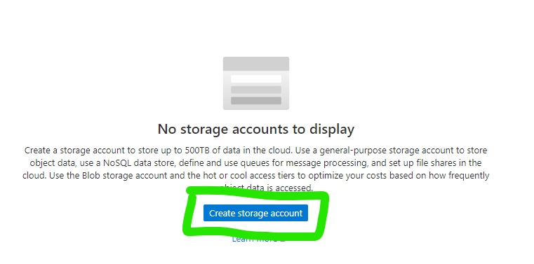
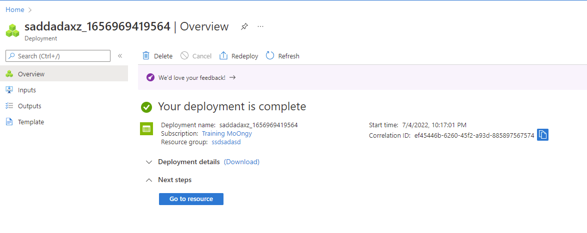
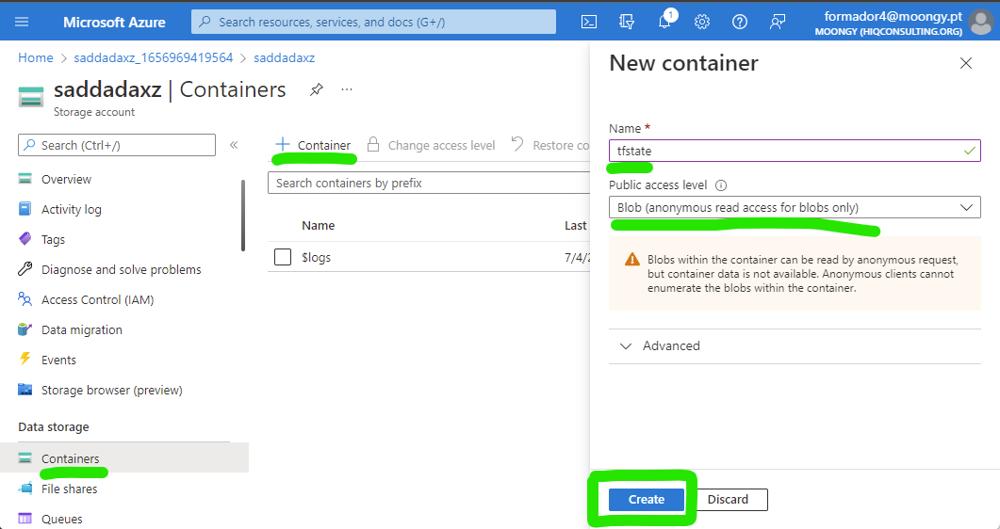
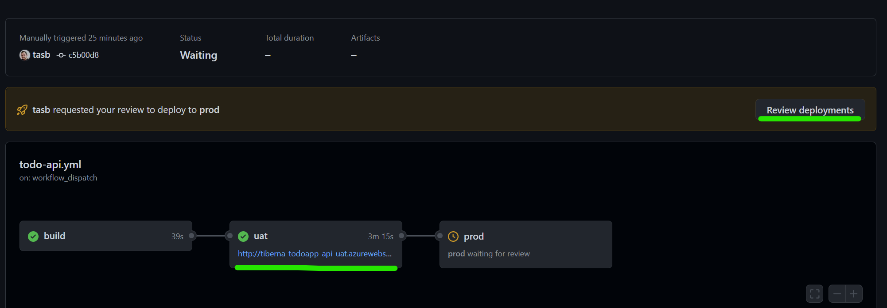
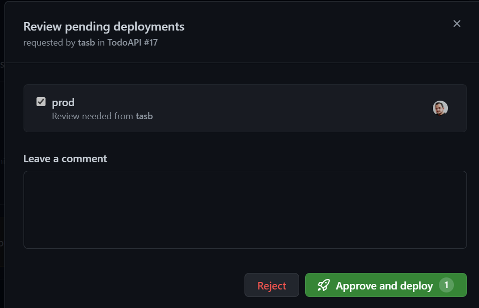
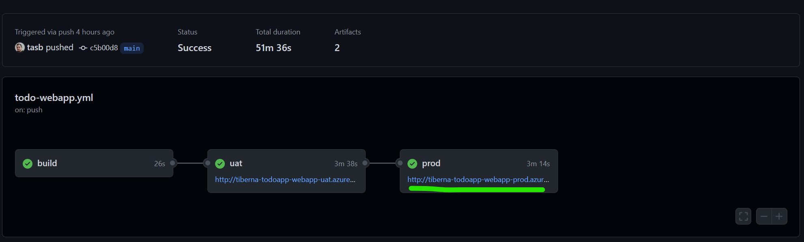

# Lab 05 - Infra as Code

On this lab you'll include a Infra as Code approach to create and validate your infrastructure before making a new deployment.

## Learning Objectives

In this lab, you will learn how to:

- Create a new Azure Storage Account to keep your Terraform state
- Create Terraform Scripts to deploy your infrastructure
- Update your workflows to include Terraform execution

## Instructions

- [Create Azure Storage](#create-azure-storage)
- [Create Terraform scripts](#create-terraform-scripts)
- [Prepare GitHub repo](#prepare-github-repo)
- [Update GitHub workflows](#update-github-workflows)
- [Run your pipelines](#run-your-pipelines)

## Create Azure Storage

You need an Azure Storage to keep your Terraform state to be used when you execute your pipeline and have access to last know state created by Terraform tool.

Navigate to [Azure Portal](https://portal.azure.com/) and login with your  credentials.

On top search box, search for `Storage Accounts` and click on the result with the same name as stated on following image.



Then you may click on `Create storage account` button in the middle of the page.



You start the wizard to create your Storage Account. You need to configure 3 fields:

1) Resource Group
   - Click on the link `Create new` below dropdown box
   - On resource group name add `<your-prefix>-tfstate-rg`
   - Click on `OK`
2) Storage account name
   - Storage accounts on Azure need to have an unique on ALL Azure subscription
   - Name is mandatory to be all in small caps
   - Add the following name `<your-prefix>tfstatestg`
3) Region
   - Select `West Europe`

Click on `Review + Create` button for Azure Resource Manager validate your configuration.

After that validation finished successfully, `Create` button will turn blue and you may click on it.

The process to create your storage account just started and you need to wait a couple of minutes until have access to your resource.

When the creation finished with success you get a screen like this.



To finalize this configuration, you need to create a container inside your Azure Storage Account.

A container can be seen as a folder and is where Terraform state files will be stored.

Click on `Go to resource` blue button and you get access to all details and configurations of your Azure Storage.

Click on `Containers` option on left side bar, then on `+ Container` and finally add `tfstate` as container name and select `Blob (anonymous read access for blobs only)` as `Public access level` and to finalize click on `Create` button.



Now you have everything ready to start to implement your Infra as Code scripts and update (or create) your workflows.

## Create Terraform scripts

you need to create a new branch to start to develop any additional code since you enable the need to use Pull Requests to update `main` branch.

To be sure you have last version, do a clean up on your local repo. First, move your repo to `main` branch.

```bash
git checkout main
```

Then, get all update from this remote repo.

```bash
git pull
```

Now you're ready to create a new branch named `add-iac`.

```bash
git checkout -b add-iac
```

Create two new folders:

1) `deploy` > `terraform` > `todo-api`
2) `deploy` > `terraform` > `todo-webapp`

Inside each folder you will create the Terraform files needed to deploy (and then destroy) your infrastructure:

- `main.tf`: main file where you define resources to be created
- `variables.tf`: each block of this file defines a variable/parameter to be used on your IaC process to make it more dynamic
- `terraform.tfvars`: where you define default values for variables/parameters defined on `variables.tf` file
- `output.tf`: where you define outputs of your IaC scripts that can be used during your CD process to set some variables

On `todo-api` folder, create a file named `variables.tf` with following content.

```terraform
variable "env" {
    type = string
    description = "Environment name to deploy"
    nullable = false
}

variable "location" {
    type = string
    description = "The Azure Region in which all resources in this example should be created."
    default = "westeurope"
}

variable "appName" {
    type = string
    description = "Application Name"
    nullable = false
}

variable "appServiceName" {
    type = string
    description = "App Service Name"
    nullable = false
}

variable "dbName" {
    type = string
    description = "Db Name"
    nullable = false
}

variable "dbAdmin" {
    type = string
    description = "Db Username"
    nullable = false
}

variable "dbPassword" {
    type = string
    description = "Db User Password"
    nullable = false
    sensitive = true
}
```

Then create a `terraform.tfvars` file with the following content. Pay attention where you need to replace `<your-prefix>` with your unique prefix.

```terraform
appName = "<your-prefix>-todoapp"
appServiceName = "api"
dbName = "<your-prefix>-todoapp-db"
dbAdmin = "dbadmin"
```

After that, let's define your outputs that will be used during CD. Create a file named `output.tf` with following content.

```terraform
output "webappName" {
    value = "${azurerm_linux_web_app.webapp.name}"
}

output "webappUrl" {
    value = "${azurerm_linux_web_app.webapp.name}.azurewebsites.net"
}

output "dbAddress" {
    value = "${azurerm_postgresql_flexible_server.db.fqdn}"
}
```

Finally, let's create `main.tf` where you define the resources to be created, uses variables defined previously and set outputs at the end of the execution.

The file must have the following content and you need to pay attention where you need to replace `<your-prefix>` with your unique prefix.

```terraform
terraform {
  backend "azurerm" {
        resource_group_name  = "<your-prefix>-tfstate-rg"
        storage_account_name = "<your-prefix>tfstatestg"
        container_name       = "tfstate"
        key                  = "terraform.tfstate"
    }
}

provider "azurerm" {
  features {}
}

# Creates a Resource Group to group the following resources
resource "azurerm_resource_group" "rg" {
  name     = "${var.appName}-${var.appServiceName}-${var.env}-rg"
  location = var.location
}

# Create the Linux App Service Plan
resource "azurerm_service_plan" "appserviceplan" {
  name                = "asp-${var.appName}-${var.appServiceName}-${var.env}"
  location            = azurerm_resource_group.rg.location
  resource_group_name = azurerm_resource_group.rg.name
  os_type             = "Linux"
  sku_name            = "B2"
}

#Create the web app, pass in the App Service Plan ID
resource "azurerm_linux_web_app" "webapp" {
  name                = "${var.appName}-${var.appServiceName}-${var.env}"
  location            = azurerm_resource_group.rg.location
  resource_group_name = azurerm_resource_group.rg.name
  service_plan_id     = azurerm_service_plan.appserviceplan.id

  site_config {
    always_on = true
    application_stack {
      dotnet_version = "6.0"
    }
  }
}

# Create Azure Database for PostgreSQL server. Database will be automatically created by Todo API code
resource "azurerm_postgresql_flexible_server" "db" {
  name                   = "${var.dbName}-${var.env}-psql"
  resource_group_name    = azurerm_resource_group.rg.name
  location               = azurerm_resource_group.rg.location
  version                = "14"
  administrator_login    = "${var.dbAdmin}"
  administrator_password = "${var.dbPassword}"
  zone                   = "1"

  storage_mb = 32768

  sku_name   = "B_Standard_B1ms"
}

# Add firewall rule on your Azure Database for PostgreSQL server to allow other Azure services to reach it
resource "azurerm_postgresql_flexible_server_firewall_rule" "example" {
  name             = "AllowAllAzureServicesAndResourcesWithinAzureIps"
  server_id        = azurerm_postgresql_flexible_server.db.id
  start_ip_address = "0.0.0.0"
  end_ip_address   = "0.0.0.0"
}
```

If you take a look again on `variables.tf` file you may find the following variable.

```terraform
variable "env" {
    type = string
    description = "Environment name to deploy"
    nullable = false
}
```

With this variables used as a input parameter you may reuse the same Terraform code to create your infrastructure for Staging and Production environment, following best practices on IaC approach that states that the way you create your resources on several environments must be always the same.

Now let's add the files to create Todo Webapp infrastructure.

On `todo-webapp` folder, create a file named `variables.tf` with following content.

```terraform
variable "env" {
    type = string
    description = "Environment name to deploy"
    nullable = false
}

variable "appName" {
    type = string
    description = "Application Name"
    nullable = false
}

variable "appServiceName" {
    type = string
    description = "Application Name"
    nullable = false
}

variable "apiName" {
    type = string
    description = "Application Name"
    nullable = false
}

variable "location" {
    type = string
    description = "The Azure Region in which all resources in this example should be created."
    default = "westeurope"
}
```

Then create a `terraform.tfvars` file with the following content. Pay attention where you need to replace `<your-prefix>` with your unique prefix.

```terraform
appName = "<your-prefix>-todoapp"
appServiceName = "webapp"
apiName = "api"
```

After that, let's define your outputs that will be used during CD. Create a file named `output.tf` with following content.

```terraform
output "webappName" {
    value = "${azurerm_linux_web_app.webapp.name}"
}

output "webappUrl" {
    value = "${azurerm_linux_web_app.webapp.name}.azurewebsites.net"
}

output "webapiUrl" {
    value = "${var.appName}-${var.apiName}-${var.env}.azurewebsites.net"
}
```

Finally, let's create `main.tf` where you define the resources to be created, uses variables defined previously and set outputs at the end of the execution.

The file must have the following content and you need to pay attention where you need to replace `<your-prefix>` with your unique prefix.

```terraform
terraform {
  backend "azurerm" {
        resource_group_name  = "<your-prefix>-tfstate-rg"
        storage_account_name = "<your-prefix>tfstatestg"
        container_name       = "tfstate"
        key                  = "terraform.tfstate"
    }
}

provider "azurerm" {
  features {}
}

resource "azurerm_resource_group" "rg" {
  name     = "${var.appName}-${var.appServiceName}-${var.env}-rg"
  location = var.location
}

# Create the Linux App Service Plan
resource "azurerm_service_plan" "appserviceplan" {
  name                = "asp-${var.appName}-${var.appServiceName}-${var.env}"
  location            = azurerm_resource_group.rg.location
  resource_group_name = azurerm_resource_group.rg.name
  os_type             = "Linux"
  sku_name            = "B2"
}

#Create the web app, pass in the App Service Plan ID, and deploy code from a public GitHub repo
resource "azurerm_linux_web_app" "webapp" {
  name                = "${var.appName}-${var.appServiceName}-${var.env}"
  location            = azurerm_resource_group.rg.location
  resource_group_name = azurerm_resource_group.rg.name
  service_plan_id     = azurerm_service_plan.appserviceplan.id

  site_config {
    always_on = true
    application_stack {
      dotnet_version = "6.0"
    }
  }
}
```

You complete the step to create Terraform scripts. But now you only have code, you need to execute this scripts.

Let's proceed with preparing your GitHub Repo adding Environments to help handle deployments.

## Prepare GitHub repo

Let's create the environments to be used by your CD pipeline.

Navigate to `Settings > Environments` and click on `New environment`.

First, you may create Staging environment. On environment name add `stg` and click on `Configure environment`.

On the new screen, click on the `Add Secret` link at the end the screen and fill the form with the following parameters:

- Name: `DB_PASSWORD`
- Value: `P@ssw0rd`

Finally, let's create Production environment. Repeat the process clicking on `New environment` button and set environment name as `prod`.

On the new screen, click on the `Add Secret` link at the end the screen and fill the form with the following parameters:

- Name: `DB_PASSWORD`
- Value: `P@ssw0rd`

In order to better protect this environment, you will add two protection rules to it.

On `Deployment protection rules` block, enable `Required reviewers` checkbox and add your GitHub username on the input box.

You need to click on `Save protection rules` to save this setting. Any other setting don't need to be explicit saved.

Doing this you are creating a pre-approval gate on your production environment, meaning someone (on this case, you) need to explicitly approve the deployment on the production environment.

Then, on `Deployment branches` block, click on the dropdown and select `Selected branches` option. Now you need to define from which repo branch are you allowed to deploy to this environment.

Click on `Add deployment branch rule` and set `main` on `Branch name pattern:` input box.

## Update GitHub workflows

At the end of this step, you will have 2 GitHub Workflows for each application component: Todo Webapp and Todo API.

On each workflow you will have 3 stages: Build, Deploy to staging and Deploy to Production.

On each Deploy stage you will not only deploy your app but you will use Terraform to create and validate your infra structure.

Now, you may edit the file `todo-api.yaml` on folder `.github/workflows` and delete all its content since we'll recreate it step by step.

First, you need to add the name, triggers, global variables and permissions for this workflow.

```yaml
name: TodoAPI

on:
  workflow_dispatch:
  push:
    branches: [ main ]
    paths:
      - 'src/TodoAPI/**'
      - 'src/TodoAPI.Tests/**'
      - '.github/workflows/todo-api.yaml'
      - 'deploy/terraform/todo-api/**'

  pull_request:
    branches: [ main ]
    paths:
      - 'src/TodoAPI/**'
      - 'src/TodoAPI.Tests/**'
      - '.github/workflows/todo-api.yaml'

env:
  ARTIFACT_NAME: "todo-api"

permissions:
  id-token: write # to use OIDC authentication
  contents: read # to read the repository contents
  checks:  write # to publish Test Results

```

On this block you set the trigger to be on any push to `main` branch and on any pull request that have `main` branch as target.

The list of paths makes the trigger to run only when there are changes on files that match those regular expressions.

Then let's add the `build` stage to build, run your tests and publish your app package and Terraform scripts.

```yaml
jobs:
  build:

    runs-on: ubuntu-latest

    steps:
    - uses: actions/checkout@v3

    - name: Setup .NET
      uses: actions/setup-dotnet@v1
      with:
        dotnet-version: 6.0.x
    
    - name: Restore projects
      shell: bash
      run: |
        dotnet restore src/TodoAPI/TodoAPI.csproj
        dotnet restore src/TodoAPI.Tests/TodoAPI.Tests.csproj

    - name: Build projects
      shell: bash
      run: |
        dotnet build --no-restore src/TodoAPI/TodoAPI.csproj -c Debug
        dotnet build --no-restore src/TodoAPI.Tests/TodoAPI.Tests.csproj -c Debug

    - name: Test
      shell: bash
      run: dotnet test --no-build src/TodoAPI.Tests/TodoAPI.Tests.csproj --verbosity normal --logger "trx;LogFileName=test-results.trx"
      
    - name: Test Report
      uses: dorny/test-reporter@v1
      if: always()
      with:
        name: Tests Results
        path: '**/TestResults/*.trx'
        reporter: dotnet-trx
    
    - name: Publish
      if: github.event_name != 'pull_request'
      run: |
        dotnet publish --no-build src/TodoAPI/TodoAPI.csproj -o src/TodoAPI/publish

    - uses: actions/upload-artifact@v3
      if: github.event_name != 'pull_request'
      with:
        name: ${{ env.ARTIFACT_NAME }}
        path: src/TodoAPI/publish

    - uses: actions/upload-artifact@v3
      if: github.event_name != 'pull_request'
      with:
        name: ${{ env.ARTIFACT_NAME }}-iac
        path: deploy/terraform/todo-api

```

Look at last 3 actions and check that all of them as the following line: `if: github.event_name != 'pull_request'`.

This condition will make this actions to run only if the trigger that made the workflow run is not a pull request since you only publish your app when you complete the pull request and merge into `main` branch.

At the end of build phase you're publishing two artifacts: your app package and your Terraform scripts.

Next step is to create the stage to deploy to staging environment.

```yaml
  stg:
    if: github.event_name != 'pull_request'
    environment: 
      name: stg
      url: ${{ steps.stg-deploy.outputs.webapp-url }}
    runs-on: ubuntu-latest
    needs: build
```

On this block you do several configurations:

- Set condition for this stage only run when trigger is not from a pull request (`if` property)
- Links this stage with the environment configured before on your repo (`environment` block)
  - `url` property on this block is an UI configuration that will put a link on GitHub Actions interface for you to directly navigate to your app
- Create dependency with previous state creating an workflow with sequence (`needs` property)

```yaml
    env: # these variables will be set as environment variables for script actions and are needed to run Terraform commands
      ARM_CLIENT_ID: ${{ secrets.AZURE_CLIENT_ID }}
      ARM_SUBSCRIPTION_ID: ${{ secrets.AZURE_SUBSCRIPTION_ID }}
      ARM_TENANT_ID: ${{ secrets.AZURE_TENANT_ID }}
      ARM_USE_OIDC: true # to use OIDC authentication on Terraform

    steps:
    - uses: actions/download-artifact@v3
      with:
        name: ${{ env.ARTIFACT_NAME }}
        path: ./${{ env.ARTIFACT_NAME }}

    - uses: actions/download-artifact@v3
      with:
        name: ${{ env.ARTIFACT_NAME }}-iac
        path: ./terraform
    
    - uses: azure/login@v1
      with:
        client-id: ${{ secrets.AZURE_CLIENT_ID }}
        tenant-id: ${{ secrets.AZURE_TENANT_ID }}
        subscription-id: ${{ secrets.AZURE_SUBSCRIPTION_ID }}
```

On this block you are setting up environment variables that will be needed for Terraform scripts to run and use Azure Storage as the backend provider.

Recall that when you use `${{ secrets.AZURE_CLIENT_ID }}` you're getting the values that you defined on the secrets configured on the repo level.

```yaml
    - uses: hashicorp/setup-terraform@v2
      with:
        terraform_wrapper: false

    - name: terraform init
      run: |
        cd ./terraform
        terraform init -backend-config="key=todoapp.webapi.stg.tfstate"

    - name: terraform validate
      run: |
        cd ./terraform
        terraform validate
    
    - name: terraform plan
      id: tfplan
      run: |
        cd ./terraform
        terraform plan -var="dbPassword=${{ secrets.DB_PASSWORD }}" -var="env=stg"

    - name: Terraform Plan Status
      if: steps.tfplan.outcome == 'failure'
      run: exit 1

    - name: terraform apply
      run: |
        cd ./terraform
        terraform apply -var="dbPassword=${{ secrets.DB_PASSWORD }}" -var="env=stg" -auto-approve
        echo "WEBAPP_NAME=$(terraform output -raw webappName)" >> $GITHUB_ENV
        echo "DB_ADDRESS=$(terraform output -raw dbAddress)" >> $GITHUB_ENV

```

Now you're setting the actions to run your Terraform scripts. Check that you're performing the common loop on Terraform: `init` > `validate` > `plan` > `apply`.

Additionally on the action called `Terraform Plan Status` you're setting an automatic gate that will look into the outcome of the `plan` phase. If a failure is spotted then your workflow will exit with an error.

With this approach you only deploy your application into your expected infrastructure and if anything is wrong with it you will not continue your CD process.

The last two lines of the `apply` action are to set the outputs defined on your Terraform scripts as environment variables to be used to configure your application.

Finally you will deploy your application on Staging environment.

```yaml
    - name: 'Azure webapp deploy - Staging'
      id: stg-deploy
      uses: azure/webapps-deploy@v2
      with: 
        app-name: ${{ env.WEBAPP_NAME }}
        package: ./${{ env.ARTIFACT_NAME }}

    - name: 'Configure azure webapp - Staging'
      uses: azure/appservice-settings@v1
      with:
        app-name: ${{ env.WEBAPP_NAME }}
        mask-inputs: false
        app-settings-json: '[{"name": "ConnectionStrings__TodosDb","value": "Server=${{ env.DB_ADDRESS }};Database=TodoDB;Port=5432;User Id=dbadmin;Password=${{ secrets.DB_PASSWORD }};Ssl Mode=VerifyFull;","slotSetting": true}]'
      id: settings

    - name: logout
      run: |
        az logout
```

On this last block you execute 3 actions:

- `Azure webapp deploy - Staging`: will deploy your package (created on `build` stage) into App Service on Azure
- `Configure azure webapp - Staging`: will configure your application to use the database just created. Take a look on `${{ env.DB_ADDRESS }}` where you're using the variables set on `apply` phase that were gather by Terraform as outputs
- `logout`: even GitHub Runners are deleted after each execution is always a best practice to logout from your Azure account to prevent any security risks.

Now let's add the final stage to deploy to your production environment.

```yaml

  prod:
    if: github.event_name != 'pull_request'
    environment: 
      name: prod
      url: ${{ steps.prod-deploy.outputs.webapp-url }}
    
    runs-on: ubuntu-latest
    needs: stg

    env:
      ARM_CLIENT_ID: ${{ secrets.AZURE_CLIENT_ID }}
      ARM_SUBSCRIPTION_ID: ${{ secrets.AZURE_SUBSCRIPTION_ID }}
      ARM_TENANT_ID: ${{ secrets.AZURE_TENANT_ID }}
      ARM_USE_OIDC: true

    steps:
    - uses: actions/download-artifact@v3
      with:
        name: ${{ env.ARTIFACT_NAME }}
        path: ./${{ env.ARTIFACT_NAME }}

    - uses: actions/download-artifact@v3
      with:
        name: ${{ env.ARTIFACT_NAME }}-iac
        path: ./terraform
    
    - uses: azure/login@v1
      with:
        client-id: ${{ secrets.AZURE_CLIENT_ID }}
        tenant-id: ${{ secrets.AZURE_TENANT_ID }}
        subscription-id: ${{ secrets.AZURE_SUBSCRIPTION_ID }}

    - uses: hashicorp/setup-terraform@v2
      with:
        terraform_wrapper: false

    - name: terraform init
      run: |
        cd ./terraform
        terraform init -backend-config="key=todoapp.webapi.prod.tfstate"

    - name: terraform validate
      run: |
        cd ./terraform
        terraform validate
    
    - name: terraform plan
      id: tfplan
      run: |
        cd ./terraform
        terraform plan -var="dbPassword=${{ secrets.DB_PASSWORD }}" -var="env=prod"

    - name: Terraform Plan Status
      if: steps.tfplan.outcome == 'failure'
      run: exit 1

    - name: terraform apply
      id: terraform
      run: |
        cd ./terraform
        terraform apply -var="dbPassword=${{ secrets.DB_PASSWORD }}" -var="env=prod" -auto-approve
        echo "WEBAPP_NAME=$(terraform output -raw webappName)" >> $GITHUB_ENV
        echo "DB_ADDRESS=$(terraform output -raw dbAddress)" >> $GITHUB_ENV

    - name: 'Azure webapp deploy - Prod'
      id: prod-deploy
      uses: azure/webapps-deploy@v2
      with: 
        app-name: ${{ env.WEBAPP_NAME }}
        package: ./${{ env.ARTIFACT_NAME }}

    - name: 'Configure azure webapp - Prod'
      uses: azure/appservice-settings@v1
      with:
        app-name: ${{ env.WEBAPP_NAME }}
        mask-inputs: false
        app-settings-json: '[{"name": "ConnectionStrings__TodosDb","value": "Server=${{ env.DB_ADDRESS }};Database=TodoDB;Port=5432;User Id=dbadmin;Password=${{ secrets.DB_PASSWORD}}; Ssl Mode=VerifyFull;","slotSetting": true}]'
      id: settings
    
    - name: logout
      run: |
        az logout
```

Take a look at this piece of code and check how similar is with staging deployment. This is a best practice since you have a common process for both environment and more important you're using always the same packages for your application and for your Terraform scripts.

Since the steps are pretty the same, this can be a great candidate to set up a [GitHub Composite Action](https://docs.github.com/en/actions/creating-actions/creating-a-composite-action). If you have time, take a look on the link and try to implement that on your repo.

Now, let's create the Github workflow for your webapp. Open `todo-webapp.yaml` file on folder `.github/workflows` and replace its content with following.

```yaml
name: TodoWebapp

on:
  workflow_dispatch:
  push:
    branches: [ main ]
    paths:
      - 'src/TodoWebapp/**'
      - '.github/workflows/todo-webapp.yaml'
      - 'deploy/terraform/todo-webapp/**'

  pull_request:
    branches: [ main ]
    paths:
      - 'src/TodoWebapp/**'
      - '.github/workflows/todo-webapp.yaml'

env:
  ARTIFACT_NAME: "todo-webapp"

permissions:
  id-token: write
  contents: read

jobs:
  build:

    runs-on: ubuntu-latest

    steps:
    - uses: actions/checkout@v3
    - name: Setup .NET
      uses: actions/setup-dotnet@v2
      with:
        dotnet-version: 6.0.x
    - name: Restore dependencies
      run: |
        dotnet restore src/TodoWebapp/TodoWebapp.csproj
    
    - name: Build
      run: |
        dotnet build --no-restore src/TodoWebapp/TodoWebapp.csproj
    
    - name: Publish
      if: github.event_name != 'pull_request'
      run: |
        dotnet publish --no-build src/TodoWebapp/TodoWebapp.csproj -o src/TodoWebapp/publish

    - uses: actions/upload-artifact@v3
      if: github.event_name != 'pull_request'
      with:
        name: ${{ env.ARTIFACT_NAME }}
        path: src/TodoWebapp/publish

    - uses: actions/upload-artifact@v3
      if: github.event_name != 'pull_request'
      with:
        name: ${{ env.ARTIFACT_NAME }}-iac
        path: deploy/terraform/todo-webapp

  stg:
    if: github.event_name != 'pull_request'
    environment: 
      name: stg
      url: ${{ steps.stg-deploy.outputs.webapp-url }}
    runs-on: ubuntu-latest
    needs: build

    env:
      ARM_CLIENT_ID: ${{ secrets.AZURE_CLIENT_ID }}
      ARM_SUBSCRIPTION_ID: ${{ secrets.AZURE_SUBSCRIPTION_ID }}
      ARM_TENANT_ID: ${{ secrets.AZURE_TENANT_ID }}
      ARM_USE_OIDC: true

    steps:
    - uses: actions/download-artifact@v3
      with:
        name: ${{ env.ARTIFACT_NAME }}
        path: ./${{ env.ARTIFACT_NAME }}

    - uses: actions/download-artifact@v3
      with:
        name: ${{ env.ARTIFACT_NAME }}-iac
        path: ./terraform
    
    - uses: azure/login@v1
      with:
        client-id: ${{ secrets.AZURE_CLIENT_ID }}
        tenant-id: ${{ secrets.AZURE_TENANT_ID }}
        subscription-id: ${{ secrets.AZURE_SUBSCRIPTION_ID }}

    - uses: hashicorp/setup-terraform@v2
      with:
        terraform_wrapper: false

    - name: terraform init
      run: |
        cd ./terraform
        terraform init -backend-config="key=todoapp.webapp.stg.tfstate"

    - name: terraform validate
      run: |
        cd ./terraform
        terraform validate
    
    - name: terraform plan
      id: tfplan
      run: |
        cd ./terraform
        terraform plan -var="env=stg"

    - name: Terraform Plan Status
      if: steps.tfplan.outcome == 'failure'
      run: exit 1

    - name: terraform apply
      run: |
        cd ./terraform
        terraform apply -var="env=stg" -auto-approve
        echo "WEBAPP_NAME=$(terraform output -raw webappName)" >> $GITHUB_ENV
        echo "WEBAPI_URL=$(terraform output -raw webapiUrl)" >> $GITHUB_ENV

    - name: 'Azure webapp deploy - Staging'
      id: stg-deploy
      uses: azure/webapps-deploy@v2
      with: 
        app-name: ${{ env.WEBAPP_NAME }}
        package: ./${{ env.ARTIFACT_NAME }}
    
    - name: 'Configure azure webapp - Staging'
      uses: azure/appservice-settings@v1
      with:
        app-name: ${{ env.WEBAPP_NAME }}
        mask-inputs: false
        app-settings-json: '[{"name": "Services__TodoAPI","value": "https://${{ env.WEBAPI_URL }}/todos/","slotSetting": true}]'
      id: settings

    - name: logout
      run: |
        az logout

  prod:
    if: github.event_name != 'pull_request'
    environment: 
      name: prod
      url: ${{ steps.prod-deploy.outputs.webapp-url }}
    runs-on: ubuntu-latest
    needs: stg

    env:
      ARM_CLIENT_ID: ${{ secrets.AZURE_CLIENT_ID }}
      ARM_SUBSCRIPTION_ID: ${{ secrets.AZURE_SUBSCRIPTION_ID }}
      ARM_TENANT_ID: ${{ secrets.AZURE_TENANT_ID }}
      ARM_USE_OIDC: true

    steps:
    - uses: actions/download-artifact@v3
      with:
        name: ${{ env.ARTIFACT_NAME }}
        path: ./${{ env.ARTIFACT_NAME }}

    - uses: actions/download-artifact@v3
      with:
        name: ${{ env.ARTIFACT_NAME }}-iac
        path: ./terraform
    
    - uses: azure/login@v1
      with:
        client-id: ${{ secrets.AZURE_CLIENT_ID }}
        tenant-id: ${{ secrets.AZURE_TENANT_ID }}
        subscription-id: ${{ secrets.AZURE_SUBSCRIPTION_ID }}

    - uses: hashicorp/setup-terraform@v2
      with:
        terraform_wrapper: false

    - name: terraform init
      run: |
        cd ./terraform
        terraform init -backend-config="key=todoapp.webapp.prod.tfstate"

    - name: terraform validate
      run: |
        cd ./terraform
        terraform validate
    
    - name: terraform plan
      id: tfplan
      run: |
        cd ./terraform
        terraform plan -var="env=prod"

    - name: Terraform Plan Status
      if: steps.tfplan.outcome == 'failure'
      run: exit 1

    - name: terraform apply
      run: |
        cd ./terraform
        terraform apply -var="env=prod" -auto-approve
        echo "WEBAPP_NAME=$(terraform output -raw webappName)" >> $GITHUB_ENV
        echo "WEBAPI_URL=$(terraform output -raw webapiUrl)" >> $GITHUB_ENV

    - name: 'Azure webapp deploy - Prod'
      id: prod-deploy
      uses: azure/webapps-deploy@v2
      with: 
        app-name: ${{ env.WEBAPP_NAME }}
        package: ./${{ env.ARTIFACT_NAME }}
    
    - name: 'Configure azure webapp - Prod'
      uses: azure/appservice-settings@v1
      with:
        app-name: ${{ env.WEBAPP_NAME }}
        mask-inputs: false
        app-settings-json: '[{"name": "Services__TodoAPI","value": "https://${{ env.WEBAPI_URL }}/todos/","slotSetting": true}]'
      id: settings

    - name: logout
      run: |
        az logout
```

Take your time to have a look on this file and see how similar if with the previous one. Again, a great opportunity to explore [GitHub Composite Action](https://docs.github.com/en/actions/creating-actions/creating-a-composite-action).

## Run your pipelines

It's time to run your CI/CD pipeline. To do so, you need to push your changes to remote repo. Start to add all your changes to be included on next commit.

```bash
git add -A
```

Then create your commit on your local repo.

```bash
git commit -m "Added iac scripts"
```

Then push your changes to remote repo.

```bash
git push --set-upstream origin add-iac
```

Now navigate to GitHub web interface and proceed with the instructions you already know to create your pull request.

As soon as you create the pull request, build stages of both GitHub Workflows will start to run and you may confirm that will finish successfully.

Then you may complete your pull request to propagate your changes to `main` branch and your full CI/CD.

To check your workflow running, you may click on `Actions` menu on top. This workflow may take some time to run since your creating all the infrastructure.

Because you set the need of a reviewer on Production environment, your both pipelines will run until the end on `stg` stage. You may seen a screen like this.



Now you can navigate to your application running on Staging environment by click on the link below `stg` stage and check everything is working on that environment. You need to perform this steps on `Todo Webapp` workflow.

After testing you feel comfortable to allow Production deployment. To do that, click on `Review deployments` button to approve that stage to run.

Click on the checkbox near the name of your environment and click on `Approve and deploy` button as stated on next image.



This stage will take several minutes to finish since you are creating your infrastructure in Azure.

You need to repeat this step on both workflows.

After stage is finished, you may navigate to our production environment by clicking on the url under `prod` stage on your workflow.



Take a little while a navigate [Azure Portal](https://portal.azure.com/)  and check all resources you just created. Since all are sharing the same subscription you'll see a lot of resources created by all attendees, so please interact only with your resources.

Congratulations! You are using a Infra as Code strategy to provision and validate your infrastructure any time you need to perform a deploy of a newer version of your application.
